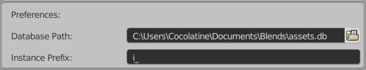
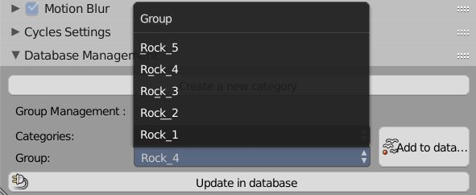
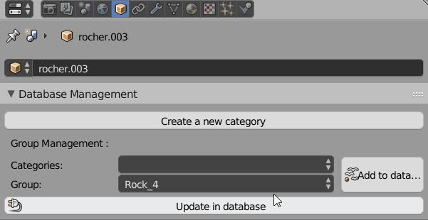
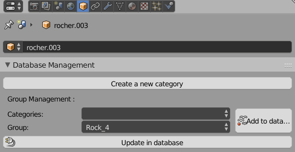

# Ropy Builder Documentation

## What is Ropy Builder ?
Ropy Builder is a Blender addon designed to help artists create complex environment set and export them to their favorite game engine.

Ropy Builder is composed og two main parts :
-A very basic asset manager that stores blender groups and puts them in categories.
-Some scattering tools to easily populate blender scenes.

## Requirements

Ropy Builder needs Blender 2.79 to fully work.

## Installation

Installation is quite straightforward. Download this repo as a zip file by clicking on the big green button Clone or Download.
In Blender, open the User Preferences and in the addon tab, click on the install from file button. Select the zip you've just downloaded and validate.

## Setting up the Database

Ropy Builder is a production tool designed for a small team that work remotely. As each member of the team can store the project's assets in a different location, we strongly recommend that the database should be stored at the root of your asset folder as illustrated in the following schema :

TODO

## Adding groups to the database

Once the database is set up, you can now create categories to sort your props. For each prop that you have modelled, you will have to create a Blender Group to encapsulate the props. Let's take an example : you have modelled five rocks models. For each rock, you have to create a new group in Blender. In your blend file, you'll have five groups, rock_1,rock_2, rock_3, rock_4 and rock_5.

Next, you have to create a new category in the database to store these groups. To do so, go in the Object Menu in the Property Windows, you will find a new DataBase Management menu, where you can create categories and assign groups to it. Simply click on the Create New Category button and enter the category name.

Once the category is added, you can now add each group to the category. Select the category and a group, and click on the Add to database button. Please note that, you have to save the blend file first, so that Ropy Builder can append the group into your future blend files.

Ropy builder will only store the path to the blend file, the name of the group, and its dimension. This allows a team to work collaboratively, you can create a placeholder group and add it to the database. The environment artist can then append this group and place it using the ropy builder tools in its level file.

## Using Ropy Builder

When building your level, you can now use the ropy builder scattering tools to fastly add props. There are currently four operators available.
